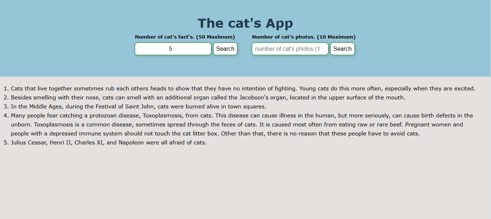
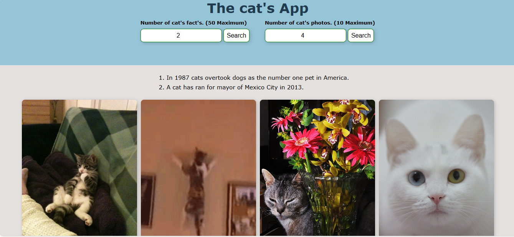
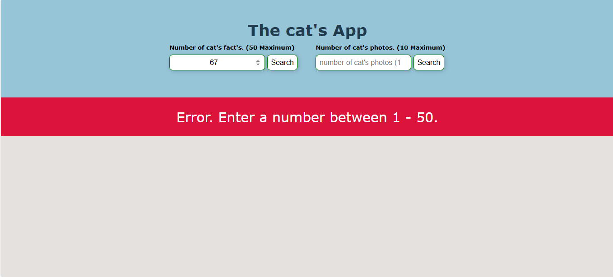

## Cat's App

This is a fun and simple web app that shows random cat facts and pictures.  
The app uses public APIs to fetch cute cat images and interesting cat facts based on the number the user provides.

---

## 📸 Web App Images

### Valid Input (Facts):

### Valid Input (Images):

### Error Message:

---

## How to Use

1. Enter a number between **1–10** to get cat images.
2. Enter a number between **1–50** to get cat facts.
3. Click the **Search** button next to each input.
4. If the number is invalid, you'll see an error message.

---

## Live APIs Used

- [TheCatAPI](https://thecatapi.com/) – for fetching cat pictures
- [MeowFacts](https://meowfacts.herokuapp.com/) – for random cat facts

---

## Technologies Used

- HTML
- CSS
- JavaScript (Vanilla)
- Async/Await & Fetch API

---

## 🙋‍♂️ Author

Made with love by [Brian Njoroge](https://github.com/briannjoroge)
